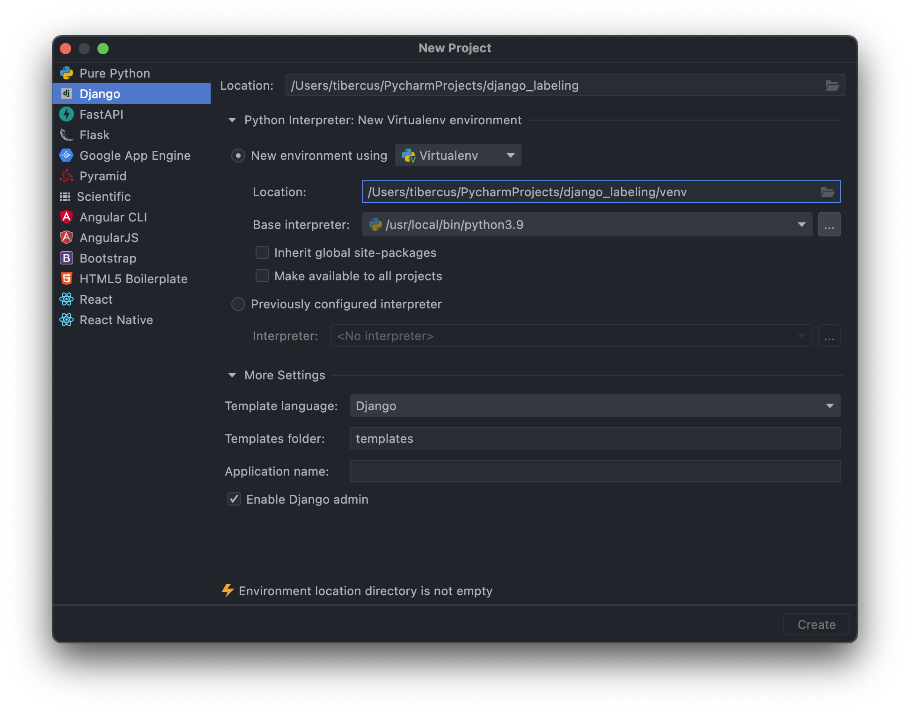

# Django-Labeling: Labeling System for Astronomy

## Setup on a local machine

1. Clone this project to a desired directory and checout to `dev` brhach to see the latest features in development:
```shell
git clone git@github.com:tibercus/django-labeling.git
git checkout dev
```
2. Setup environment file `.env` in project's root. E.g.
```shell
DEBUG=True

SECRET_KEY=django-insecure-6**y5588(q@y#+^h54z$-j^8h%=kv$)4y!&56=u&+mk%wo#1ja
```
3. Copy latest development SQLite database to project's root.
4. Create environment (i.e. Virtualenv or Conda) and nstall all required dependendencies:
```shell
pip install -r requirements.txt
```
5. To make sure that database schema matches Django models, run migrations commands in the project's root (ideally, no migrations should be applied):
```shell
python manage.py makemigrations
python manage.py migrate
```
6. Run server. From project's root:
```shell
python manage.py runserver
```
7. Create Django superuser for development if you don't know one exists:
```shell
python manage.py createsuperuser
```


## Setup project in PyCharm (optional)

1. Start creating a new project.
2. Configure project like on the screenshot below. Key points are:
    - Choose Django instead of Pure Python to enable support of Django features in PyCharm (only available in Professional Edition)
    - Project's directory name must not contain dashes (i.e. `django_project`, not `django-project`).
    - If already created, choose the desired environment for the project. Otherwise, create new environment with Virtualenv.
   
3. Go through steps 1 -- 7 above if you hadn't.
